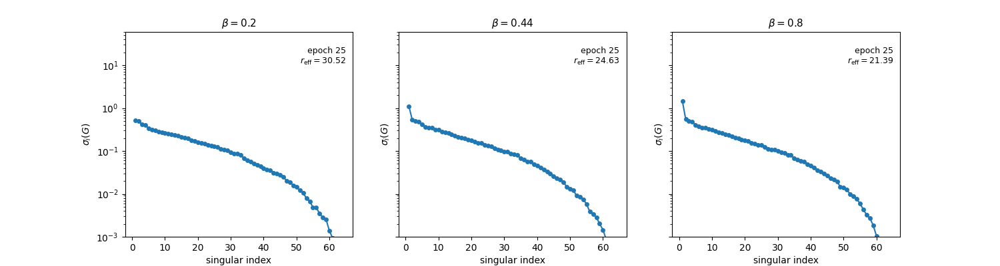
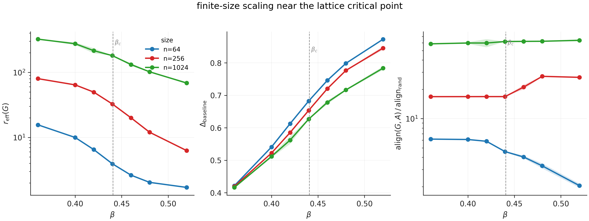
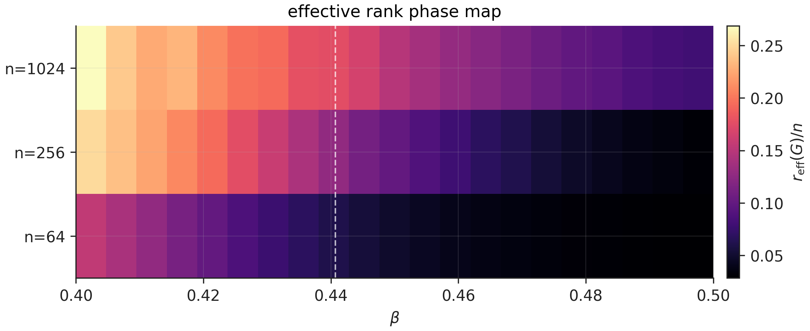
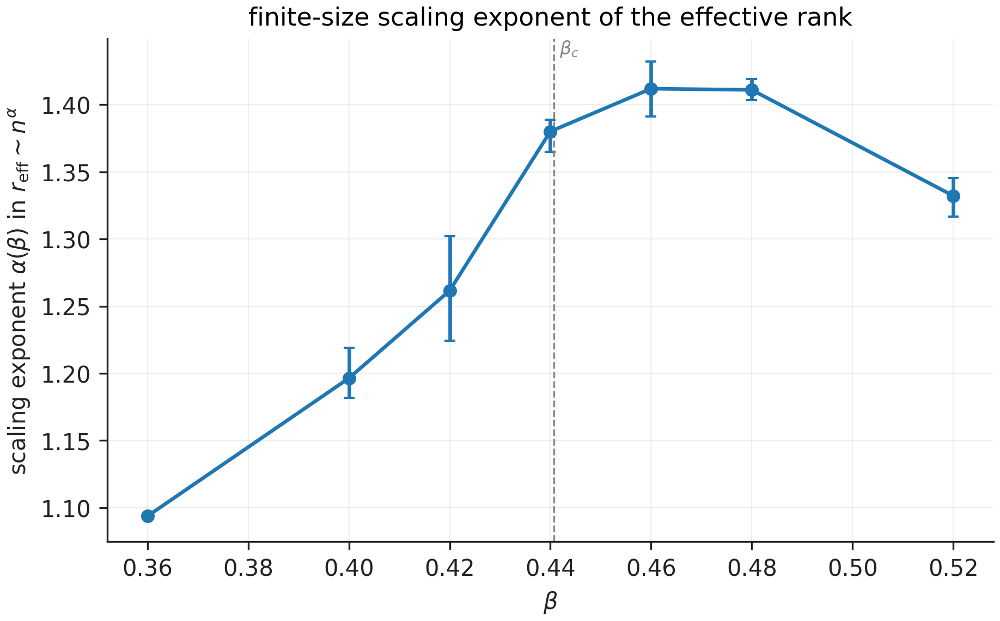
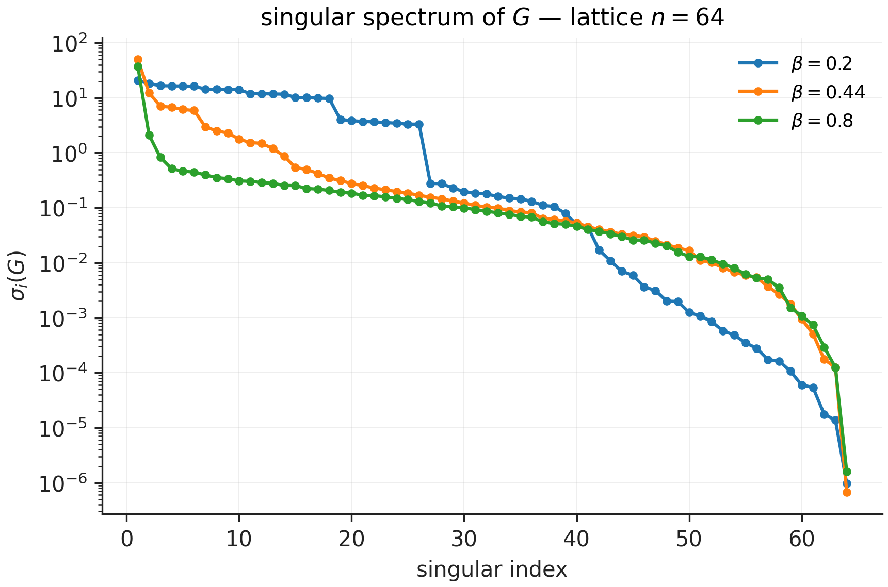
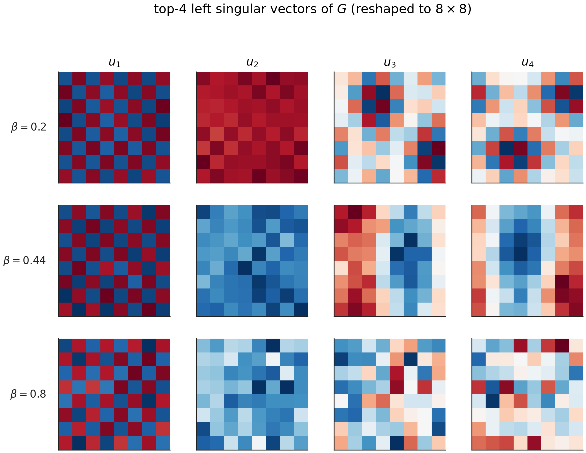
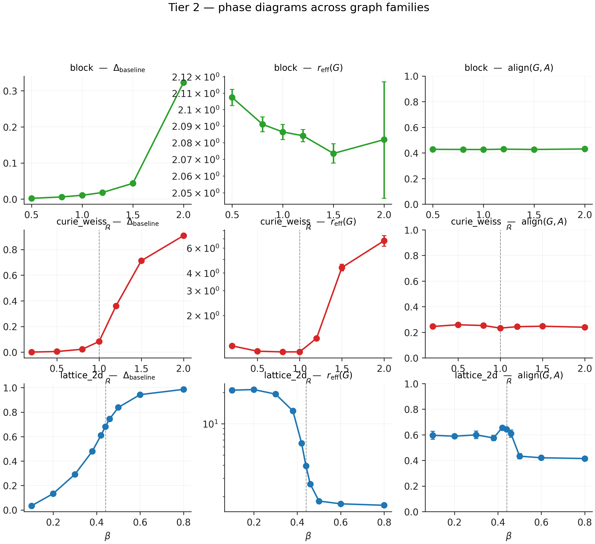
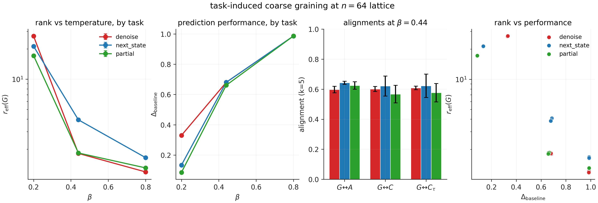
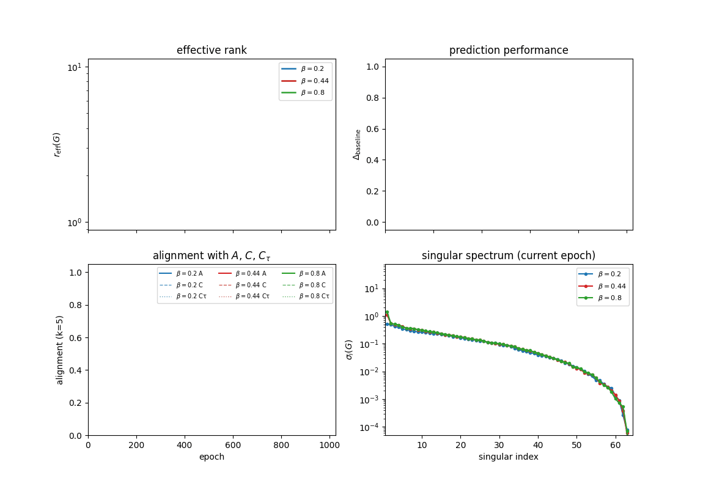

# A Learned Effective Operator in an RNN Trained on Ising Dynamics

*In a controlled spin-system setting, projecting an RNN's recurrence back into
spin space gives a learned operator $G=RJB$. Its spectrum, effective rank, and
modes track temperature, finite-size scale, graph symmetry, and task. This is
not a full theory of what the RNN learned, but it is a useful observable of the
network's learned dynamics.*

---

A recurrent neural network has no reason to organize its hidden units like the
physical degrees of freedom in the data. Hidden unit 17 is not spin 17. The
recurrent matrix $J$ is written in an arbitrary learned basis. So if we train an
RNN on a physical system and then stare directly at $J$, we may be looking in
the wrong coordinates.

The useful move in this project was to put part of the network back into the
physical basis.

I trained a vanilla RNN on trajectories from an Ising model. The data are spin
configurations

$$
s_t\in\{-1,+1\}^n,
$$

evolving under synchronous Glauber dynamics with known coupling matrix
$A\in\mathbb R^{n\times n}$. The RNN sees $s_t$ and predicts $s_{t+1}$. Its
input map is $B$, its recurrent matrix is $J$, and its readout is $R$. The
recurrent pathway, projected back into spin space, is

$$
G = R\,J\,B.
$$

This is the main diagnostic in the post. $J$ lives in hidden space and is not
directly comparable to the physical coupling matrix. $G$ lives in spin space.
That means $G$ can be compared to spin-space objects: the microscopic coupling
$A$, the equilibrium covariance $C$, and the lagged covariance $C_\tau$.

The question I started with was:

> Does an RNN trained on Ising dynamics learn low-rank structure?

I now think that was the wrong question. A better one is:

> Which spin-space degrees of freedom does the RNN use to solve the task?

*The singular spectrum of the learned spin-space recurrent operator
$G=RJB$ during training, at high temperature ($\beta=0.2$), near the
critical region ($\beta=0.44$), and low temperature ($\beta=0.8$).
[MP4](figures/blog/animations/singular_spectrum_three_betas.mp4).*

The animation above is the shortest version of the story. The high-temperature
operator keeps many modes alive. The low-temperature operator concentrates into
a few dominant directions. The near-critical run sits between them and reaches
its final spectrum more slowly. None of these training runs were given an
explicit notion of phase; they only saw spin trajectories.

The rest of the post is an attempt to say carefully what this does and does
not show.

---

## Loss and geometry are different observables

The RNN is trained with MSE on $\pm 1$ spin targets. The zero predictor has
loss $\approx 1$, so I measure prediction improvement by

$$
\Delta_{\rm baseline} = \frac{L_{\rm zero} - L_{\rm model}}{L_{\rm zero}}.
$$

Prediction gets easier as $\beta$ increases: at high temperature the next
state is genuinely noisy; at low temperature it is mostly determined by the
current one. That part is expected.

The geometry of $G$ tells a different story.

*$n \in \{64, 256, 1024\}$, 21 β values around the critical region × 3 seeds.
Left: effective rank of $G$. Centre: prediction improvement. Right:
alignment of $G$'s top-10 left singular subspace with $A$'s, normalized by
a random baseline. Vertical line: lattice critical inverse temperature
$\beta_c = \tfrac{1}{2}\ln(1+\sqrt 2) \approx 0.4407$.*

A useful separation is

$$
\Delta_{\rm baseline} \approx f(\beta),
\qquad
r_{\rm eff}(G) \approx f(\beta, n).
$$

Prediction difficulty is mostly set by temperature. Learned geometry is set by
temperature *and* scale.

This makes sense. The conditional law of Glauber dynamics is local,

$$
\mathbb E[s_i(t+1)\mid s_t] = \tanh\!\big(\beta\,\ell_i(s_t)\big),
$$

so the per-site prediction problem has a thermodynamic-limit difficulty mostly
set by $\beta$. But the *global* operator $G$ has to choose a basis of spatial
modes, and the number of useful modes depends on system size.

Loss asks whether the network predicts. $G$ asks what directions it uses to
predict.

---

## A phase diagram of learned dimension

The most compact way to see the result is to plot the effective rank of $G$,
normalized by system size, as a function of $\beta$ and $n$.

*Phase map of $r_{\rm eff}(G)/n$ from a dense critical zoom: 21 β values evenly
spaced from 0.400 to 0.500. The vertical dashed line marks $\beta_c$.*

At high temperature, the operator is broad: the network keeps many microscopic
directions alive. As $\beta$ increases, the operator compresses. The Ising
model develops stronger correlations and eventually an ordered phase, and the
network can predict through fewer collective directions.

A coarser version of this experiment made the transition look like a sharp
collapse at $\beta_c$. The dense critical sweep tells a more careful story:
finite systems see a smooth crossover. The learned rank does not fall off a
cliff. It flows.

To quantify this flow, I fit, at each $\beta$,

$$
r_{\rm eff}(G; n, \beta) \sim n^{\alpha(\beta)},
$$

using $n \in \{64, 256, 1024\}$ and bootstrap resampling over seeds.

*Bootstrapped finite-size scaling slope $\alpha(\beta)$ in
$r_{\rm eff}(G)\sim n^{\alpha(\beta)}$. Bars: 95% interval from 1000
seed-resamples per β.*

$\alpha(\beta)$ rises from about $1.20$ at $\beta = 0.400$, peaks near
$\beta \approx 0.465\text{–}0.470$ at $\alpha \approx 1.42$, then drifts down
to $\approx 1.37$ at $\beta = 0.500$. The maximum is inside the finite-size
critical window but slightly above the infinite-volume $\beta_c$.

I would not call $\alpha(\beta)$ a universal critical exponent. It is an
empirical finite-size scaling slope for a learned operator, fit from three
system sizes. But it is the right *kind* of observable: it asks how the number
of useful recurrent directions scales with system size, and it shows that the
learned representation has a scale-dependent critical window.

So the claim is not that the RNN detects an exact mathematical critical point.
The claim is softer and, I think, more interesting: the learned recurrent
geometry has a finite-size crossover organized around the critical region.

---

## What does the learned operator look like?

The singular values tell us how many directions matter. The singular vectors
tell us what those directions are.

*$\sigma_i(G)$ vs index for the lattice $n=64$ at three temperatures.
At $\beta = 0.2$ the tail stays broad; at $\beta = 0.44$ the spectrum has a
small leading set of modes; at $\beta = 0.8$ only the first few directions
matter.*

*Top-4 left singular vectors of $G$ for the lattice $n=64$, reshaped onto the
$8\times 8$ grid. Each row is one temperature. The modes are spatial.*

This is where the effective-description language becomes visually meaningful.
The learned recurrent pathway is not just a black-box matrix with lower rank.
It has modes, and those modes look like spatial modes of the underlying
lattice.

There is a subtlety worth flagging. A post-hoc $k$-sweep over alignment showed
that the top *two*-dimensional subspace of $G$ aligns extremely well with the
top-2 subspace of $A$ across the temperatures tested. So the right story is not

> the RNN discovers the physical coupling only near criticality

but

> the RNN robustly finds a core physical subspace, and temperature controls how
> many additional directions survive.

The core is found. The tail is pruned.

---

## Not everything becomes low-rank

If I had only studied the lattice, I might have written the wrong post. Maybe
RNNs just like low rank; maybe training always compresses recurrent dynamics
into a few directions; maybe the Ising model is incidental.

So I also trained on Curie–Weiss and block Ising systems. Curie–Weiss has
all-to-all couplings $J/n$, so its coupling matrix is essentially
magnetization-like. Block Ising has two communities with strong within-block
coupling $J_{\rm in}/n$ and weak between-block coupling $J_{\rm out}/n$.

*Phase diagrams across three graph families at $n=64$. The lattice shows the
crossover discussed above. Curie–Weiss is essentially rank-one until $\beta$
exceeds the mean-field transition at $\beta \approx 1$; then
$r_{\rm eff}(G)$ grows, because the network starts using additional directions
to track fluctuations around the magnetization. The block model stays close to
$r_{\rm eff}(G)\approx 2$, matching the two-community structure.*

The three graph families behave qualitatively differently. The simple
"RNNs learn low rank" reading does not survive this figure. A better one is:

> The learned operator reflects the symmetry of the data-generating process.

Curie gives a magnetization direction; block gives community modes; lattice
gives a scale-dependent spectrum of spatial modes. Low rank is not the cause.
It is one possible signature of the relevant effective degrees of freedom.

---

## Task-induced coarse-graining

The cleanest evidence for the effective-description view comes from changing
the task.

At the same critical-region temperature, I trained three versions:

1. `next_state`: see $s_t$, predict $s_{t+1}$.
2. `denoise`: see a $30\%$-corrupted $s_t$, reconstruct the clean $s_t$.
3. `partial`: see only $50\%$ of the spins, predict the full $s_{t+1}$.

*Same lattice ($n=64$), same temperature ($\beta=0.44$), three tasks.
Right panel: rank-vs-performance scatter. Denoise and partial sit at roughly
the same $\Delta_{\rm baseline}$ as `next_state` but at about half the
effective rank.*

At $\beta = 0.44$, all three tasks have nearly identical prediction
performance:

| task         | $\Delta_{\rm baseline}$ | $r_{\rm eff}(G)$ |
|--------------|------------------------:|-----------------:|
| `next_state` |                   0.681 |             3.93 |
| `denoise`    |                   0.680 |             1.82 |
| `partial`    |                   0.661 |             1.84 |

Denoising and partial observation roughly halve the effective rank with little
performance cost.

This is the most direct evidence that the learned geometry is task-dependent.
The same physical system, at the same temperature, induces a different
effective operator when the task changes.

In renormalization language, the task defines which details need to be kept to
make the desired prediction. Corrupted or missing microscopic details are made
irrelevant by construction, and the network responds by keeping a smaller set
of directions. Same data-generating physics, different operational notion of
what matters.

---

## Watching the effective operator form

*Training dashboard at three temperatures. Top-left: $r_{\rm eff}(G_t)$ vs
epoch. Top-right: $\Delta_{\rm baseline}$. Bottom-left: alignments with $A$,
$C$, and $C_\tau$. Bottom-right: singular spectrum at the current epoch.
[MP4](figures/blog/animations/training_dashboard_three_betas.mp4).*

Early in training, $G$ is close to random. As loss falls, the spectrum reshapes
and alignment with physical operators rises. The recurrent pathway becomes an
operator with recognizable spin-space structure, and the shape of that
structure depends on temperature.

The point is not that RNNs execute an explicit renormalization algorithm during
training. They do not. The point is that this controlled setting — a known
physical data-generating system, plus a recurrent pathway that can be projected
back into the physical basis — makes the dependence between training and
effective description unusually visible.

---

## What I think this shows

The original question was:

> Do RNNs trained on Ising dynamics learn low-rank structure?

The answer is:

> Sometimes, but that was the wrong question.

The better question is:

> What spin-space operator does the RNN learn?

In this experiment, the answer is that $G=RJB$ tracks several things that are
physically or operationally meaningful:

- **temperature** — phase-dependent rank, alignment, and training dynamics;
- **finite-size scale** — $r_{\rm eff}$ changes systematically with $n$;
- **the critical window** — $\alpha(\beta)$ peaks slightly above $\beta_c$ with
  a smooth finite-size crossover;
- **graph symmetry** — lattice, Curie–Weiss, and block produce qualitatively
  different rank trends;
- **task** — at the same physics, denoise and partial observation use a tighter
  effective operator.

So the result is not

$$
\text{RNNs like low rank.}
$$

The result is closer to

$$
\text{In this controlled setting, the projected recurrent pathway }G=RJB
\text{ behaves like a task- and scale-dependent effective operator.}
$$

That is why the experiment feels adjacent to renormalization. Not because I ran
an RG algorithm — I did not — but because the learned recurrent pathway behaves
like a scale- and task-dependent description: it throws away microscopic detail
when the phase and task allow it, and keeps additional modes when prediction
requires them.

In this setting, $G$ is an interpretable observable of what the network has
learned.

---

## Caveats

First, $G = RJB$ is a linear structural proxy for the recurrent pathway. The
RNN is nonlinear, and the true local Jacobian depends on activation derivatives
and current hidden state. So $G$ should be read as the spin-space *shadow* of
the recurrent pathway, not the complete dynamics. I chose $G$ because it lives
in spin space, not because it is the strongest possible probe. A natural
follow-up is to compute a trajectory-averaged projected Jacobian.

Second, the scaling slope $\alpha(\beta)$ is empirical. It is fit from
$n \in \{64, 256, 1024\}$ — three sizes — and bootstrapped over seeds. I am not
claiming that it is a universal critical exponent. The point is that it has a
structural feature we would expect from a finite-size critical-window effect,
not that its value is exactly $1.42$.

Third, this is a clean synthetic system. That is a feature for the experiment:
the data have a known physical operator, the task is closed-form defined, and
the RNN architecture is simple enough that the recurrent pathway has a
well-defined spin-space projection. None of those properties transfer for free
to language models or other frontier systems.

The broader methodological lesson is:

> If you can identify the right basis and the right projected operator, some
> neural network internals can become physical observables.

That is the part I think is worth exporting.

---

## Appendix: what got cut

A few figures I built but kept out of the main narrative:

- [`matrix_heatmaps_lattice64.png`](figures/blog/matrix_heatmaps_lattice64.png) —
  side-by-side heatmaps of $A$, $C$, $C_\tau$, and $G$ at three temperatures.
- [`relative_alignment_phase_diagram.png`](figures/blog/relative_alignment_phase_diagram.png)
  and [`relative_alignment_A_C_Ctau.png`](figures/blog/relative_alignment_A_C_Ctau.png) —
  alignment normalized by the random-baseline $k/n$. The absolute alignment
  numbers can be misleading at large $n$ because the random reference shrinks;
  these plots correct for that.
- [`effective_rank_raw_heatmap.png`](figures/blog/effective_rank_raw_heatmap.png)
  and [`effective_rank_log_heatmap.png`](figures/blog/effective_rank_log_heatmap.png) —
  the finite-size phase map in absolute and log scales.
- Per-temperature $G$-heatmap animations:
  [β=0.2](figures/blog/animations/G_heatmap_beta0p200_next_state.gif),
  [β=0.44](figures/blog/animations/G_heatmap_beta0p440_next_state.gif),
  [β=0.8](figures/blog/animations/G_heatmap_beta0p800_next_state.gif), plus
  task variants for [denoise](figures/blog/animations/G_heatmap_beta0p440_denoise.gif)
  and [partial](figures/blog/animations/G_heatmap_beta0p440_partial.gif).
- Top-4 mode animation at criticality:
  [`top_modes_beta0p440.gif`](figures/blog/animations/top_modes_beta0p440.gif).

Total: 388 production training runs on a single H100; the code, full numerical
tables, and per-run JSON histories are on GitHub. Figures are reproducible via
`python scripts/build_blog_figures.py --all` and `python scripts/build_animations.py`.

---

*One paragraph summary, if you only have time for one: I trained RNNs on
Ising/Glauber trajectories and projected the learned recurrence back into spin
space as $G = RJB$. This made it possible to compare the network's recurrent
pathway to physical operators like the coupling matrix $A$, covariance $C$, and
lagged covariance $C_\tau$. Across 388 training runs, $G$'s geometry tracked the
statistical mechanics of the data: its effective rank flowed smoothly across the
critical window, its finite-size scaling slope peaked slightly above $\beta_c$,
different graph symmetries produced different rank trends, and
denoising/partial-observation tasks compressed similar physical content into
fewer recurrent directions. The result is not that RNNs universally learn
low-rank structure; it is that, in this controlled setting, the learned
recurrent pathway behaves like a task- and scale-dependent effective operator
for the spin dynamics.*