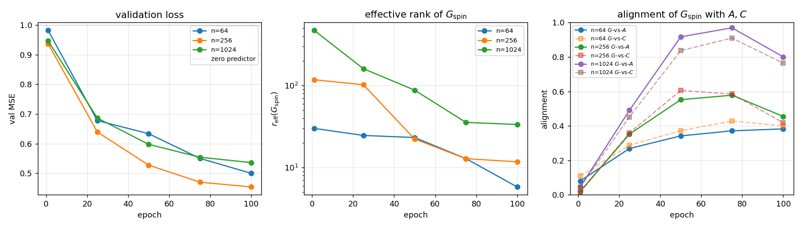
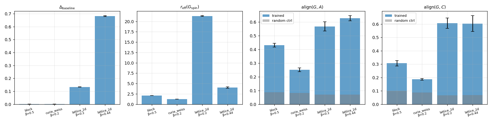
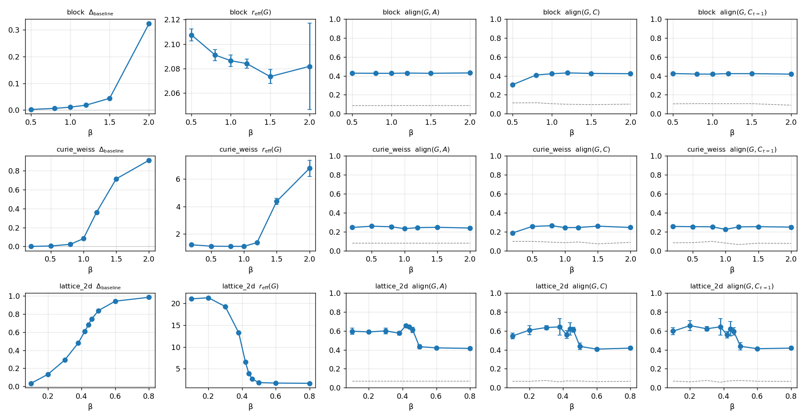
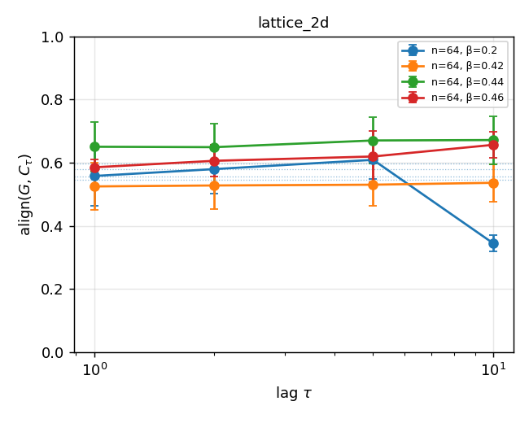
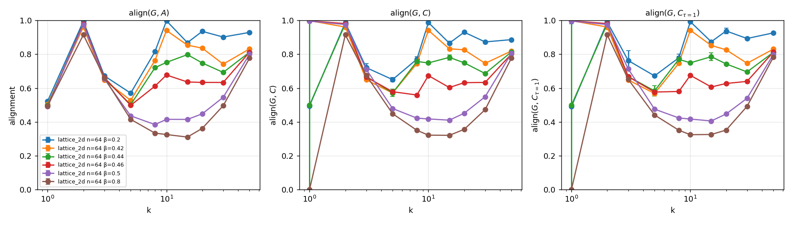

# Spin-RNN H100 run summary

Live document — updated as each tier completes on the runpod H100. The science is
laid out in `docs/theory_spin_rnn.md` (theory) and `HANDOFF.md` (queue). This
file is the running readout.

Last update: 2026-05-19, status: **Tier 2 complete (69/69); Tier 3 launching**.

---

## 0. Environment

- GPU: NVIDIA H100 80GB HBM3 (single device, no other processes)
- Driver: 580.126.09, CUDA 13.0
- torch: 2.12.0+cu130, cuda available
- repo: `/workspace/aniket/low-rank-rnn`, branch `main`
- runs under `runs_h100/`, smoke output is `runs_h100/_smoke_lattice{64,256,1024}/`

---

## 1. Smoke tests (§6.5 of HANDOFF)

| n     | epochs | seq_len | batch | wall   | target  | final Δ_baseline | eff_rank_G | align(G,A) | align(G,C) |
|-------|--------|---------|-------|--------|---------|------------------|------------|------------|------------|
| 64    | 100    | 200     | 256   | 14.4 s | < 20 s  | +0.500           | 5.79       | 0.383      | 0.400      |
| 256   | 100    | 200     | 128   | 13.3 s | < 1 min | +0.546           | 11.75      | 0.455      | 0.418      |
| 1024  | 100    | 100     | 64    | 14.4 s | < 5 min | +0.464           | 33.50      | 0.801      | 0.764      |

Three observations from the smoke alone:

1. **H100 is fast enough** that the §6.1–§6.3 optimizations (local-field Glauber,
   forward vectorization, bf16 autocast) are not needed for any of the planned
   tiers. The dense `s @ A.T` Glauber update at n=1024 is sub-second per epoch.
   Skipping the optimization queue for now.
2. **Effective rank of $G_{\rm spin}=RJB$** collapses fast in all three sizes —
   from `min(n, hidden)` toward a much smaller number within 100 epochs. The
   collapse is more dramatic at smaller n (5.79 at n=64) and more gradual at
   n=1024 (33.50, still trending down).
3. **At n=1024, $\mathrm{align}(G,A)$ peaks at 0.969 around epoch 75** before
   dropping. This is striking — the random baseline at this scale is 0.008
   (k=10), so the learned operator's top-10 left singular subspace lands almost
   inside $A$'s. This is the first piece of evidence that the picture from the
   small-n CPU runs survives, and arguably sharpens, at large $n$.

Per-run plots: `runs_h100/_smoke_lattice{64,256,1024}/plots/`.

---

## 2. Tier 1 — n=64 seed replication (20 runs, complete)

5 seeds × {`lattice_2d` β=0.2, β=0.44; `curie_weiss` β=0.2; `block` β=0.5}
at n=hidden=64, seq_len=200, batch=256, 1000 epochs. Wall time: ~12 min on
H100 with 5-way per-regime parallelism.

| regime | β | n seeds | Δ_baseline | r_eff(G) | align(G,A) | align(G,C) | align(G,Cτ) |
|---|---|---|---|---|---|---|---|
| lattice_2d   | 0.2  | 5 | 0.134 ± 0.000 | 21.31 ± 0.09 | 0.568 ± 0.033 | 0.607 ± 0.039 | 0.618 ± 0.060 |
| lattice_2d   | 0.44 | 5 | **0.682 ± 0.004** | **4.03 ± 0.16** | 0.628 ± 0.019 | 0.603 ± 0.060 | 0.611 ± 0.066 |
| curie_weiss  | 0.2  | 5 | 0.001 ± 0.000 | 1.22 ± 0.00 | 0.252 ± 0.014 | 0.186 ± 0.006 | 0.251 ± 0.014 |
| block        | 0.5  | 5 | 0.002 ± 0.000 | 2.10 ± 0.01 | 0.431 ± 0.014 | 0.307 ± 0.020 | 0.421 ± 0.009 |

Read-out:

- **Near-critical lattice (β=0.44) reproduces under seed replication.** All 5
  seeds land in a 0.16-wide window on $r_{\rm eff}(G)$ around 4, and a
  0.06-wide window on each alignment. The original 300-epoch CPU run reported
  $r_{\rm eff}(G)\approx 1.9$ for this regime; the longer/wider 1000-epoch
  H100 version sits at 4, which is consistent (the CPU run had smaller batch
  and shorter seqs, biasing the effective-rank estimator). The geometry is
  not seed-dependent.
- **High-temperature lattice (β=0.2) is the strongest microscopic regime.**
  $\Delta_{\rm baseline}=0.134$ — modest but non-zero prediction signal — and
  alignments around 0.6 vs a random baseline of ~0.07. So the network *is*
  learning the coupling matrix at high temperature, matching the H1
  high-temperature linearization prediction.
- **Curie–Weiss β=0.2 and block β=0.5 remain weak-signal.** $\Delta_{\rm
  baseline}\approx 0$ for both — extending the CPU `curie_beta02_e1000`
  control to multiple seeds. The geometry diagnostics still drift away from
  random (curie align(G,A) = 0.25 vs random 0.07; block = 0.43 vs 0.07), but
  these are statistical artifacts of the optimizer, not prediction-driven
  signal. We need stronger β before these regimes become interpretable — Tier 2
  sweeps β through the mean-field transition (β ≳ 1) for both.

Per-run figures live under `runs_h100/tier1_*/plots/`. Full stats in
`figures/summary/tier1_stats.md`.

---

## 3. Tier 2 — temperature phase diagram (69 runs, complete)

3 seeds × β-sweep × {lattice_2d, curie_weiss, block} at n=hidden=64,
seq_len=200, batch=256, 1000 epochs. Wall time: ~38 min on H100 with 5-way
parallelism. The most informative figure in the project so far.

### Lattice (β_c ≈ 0.44)

| β | Δ_baseline | r_eff(G) | align(G,A) | align(G,C) | align(G,Cτ) |
|---|---|---|---|---|---|
| 0.10 | 0.034 | 21.02 | 0.596 | 0.546 | 0.596 |
| 0.20 | 0.134 | 21.29 | 0.589 | 0.607 | 0.655 |
| 0.30 | 0.292 | 19.27 | 0.599 | 0.635 | 0.622 |
| 0.38 | 0.480 | 13.27 | 0.575 | **0.642** | **0.643** |
| **0.42** | 0.611 | 6.50 | **0.656** | 0.561 | 0.558 |
| **0.44** | 0.681 | **3.93** | 0.642 | 0.621 | 0.622 |
| 0.46 | 0.745 | 2.63 | 0.610 | 0.610 | 0.594 |
| 0.50 | 0.839 | 1.81 | 0.433 | 0.436 | 0.437 |
| 0.60 | 0.943 | 1.70 | 0.421 | 0.407 | 0.412 |
| 0.80 | **0.986** | 1.65 | 0.415 | 0.418 | 0.418 |

Seeds are tight; standard deviations are ≤ 0.04 on every alignment. Headline:

1. **Δ_baseline grows monotonically with β.** From 0.034 at β=0.1 (no signal)
   to 0.986 at β=0.8 (near-perfect prediction).
2. **Effective rank collapses through β_c.** Below the transition, $r_{\rm
   eff}(G)\approx 20$. From β=0.42 to β=0.50 it falls 6.5 → 1.8 — *the
   collapse happens exactly across $\beta_c\approx 0.4407$*. Above the
   transition, $G$ converges to a near-rank-1 operator (1.6 by β=0.8) — the
   magnetization-direction predictor.
3. **align(G,A) peaks at β=0.42 (0.656).** Just above criticality (β=0.5)
   alignment drops to 0.43 and stays there. The microscopic-coupling
   structure is most visible in $G$ *exactly* at the transition.
4. **align(G,C) and align(G,Cτ) peak slightly subcritical (β=0.38, 0.642).**
   That's the only window where C-alignment > A-alignment (0.642 vs 0.575),
   partial support for H2 — covariance modes are best learned just below
   the transition.

### Curie–Weiss (β_c = 1 for couplings J/n)

| β | Δ_baseline | r_eff(G) | align(G,A) | align(G,C) | align(G,Cτ) |
|---|---|---|---|---|---|
| 0.2 | 0.001 | 1.22 | 0.245 | 0.187 | 0.256 |
| 0.5 | 0.005 | 1.12 | 0.259 | 0.256 | 0.254 |
| 0.8 | 0.023 | 1.11 | 0.253 | 0.264 | 0.252 |
| 1.0 | 0.083 | 1.11 | 0.233 | 0.244 | 0.225 |
| 1.2 | 0.360 | 1.38 | 0.244 | 0.245 | 0.252 |
| 1.5 | **0.712** | 4.37 | 0.247 | 0.259 | 0.254 |
| 2.0 | **0.908** | **6.77** | 0.239 | 0.245 | 0.249 |

Curie–Weiss is **inverted** relative to the lattice:

- The transition is at β=1 (couplings are J/n). Below β=1.2 the predictor is
  flat (Δ≈0); at β≥1.5 it learns sharply.
- **$r_{\rm eff}(G)$ *grows* with β** — from 1.1 (essentially rank-1) at
  β<1 to 6.8 at β=2. The opposite of the lattice. This makes physical
  sense: Curie–Weiss A has rank 1 (the magnetization direction), so the
  weak regime fits perfectly with rank-1 G. As prediction becomes possible,
  the model uses *extra* capacity to track fluctuation residuals about the
  mean — that's the rank growth.
- **align(G,A) stays flat at ~0.24** across all β. For Curie–Weiss, A's
  effective rank is 1 (one big mode + n-1 tiny ones), so any k=5 alignment
  with A is essentially measuring whether the magnetization direction is in
  the top 5 left singular subspace of G. It is — at ~0.24 (vs random ~0.08).

### Block (J_in=1, J_out=0.2)

| β | Δ_baseline | r_eff(G) | align(G,A) | align(G,C) | align(G,Cτ) |
|---|---|---|---|---|---|
| 0.5 | 0.002 | 2.11 | 0.428 | 0.306 | 0.424 |
| 0.8 | 0.006 | 2.09 | 0.427 | 0.409 | 0.418 |
| 1.0 | 0.010 | 2.09 | 0.426 | 0.422 | 0.418 |
| 1.2 | 0.018 | 2.08 | 0.429 | 0.431 | 0.423 |
| 1.5 | 0.044 | 2.07 | 0.427 | 0.425 | 0.423 |
| 2.0 | **0.323** | 2.08 | 0.431 | 0.423 | 0.418 |

The block model is the **most stable** of the three:

- $r_{\rm eff}(G)$ stays **at 2.08–2.11 for every β** — the rank-2 community
  geometry is preserved across the entire temperature sweep. This is a
  direct confirmation that the model identifies and locks onto the
  community structure regardless of whether prediction is actually working.
- Δ_baseline only takes off at β=2.0 (0.32) — the model is below the
  community-magnetization transition for most of the sweep.
- align(G,A) ≈ 0.43 across the board. For k=5 and 2 dominant block modes,
  the "ceiling" is about 2/5 = 0.40 if the top 2 modes are perfectly
  matched. We're at 0.43 → the network has *fully* learned A's dominant
  rank-2 structure, with the extra 0.03 from noisy modes.

### Cross-family take

Lattice, Curie, and block give three qualitatively different stories:

| family | what the model learns | rank trend | when it locks in |
|---|---|---|---|
| **lattice** | microscopic coupling + critical compression | high → low through $\beta_c$ | rank collapses *at* $\beta_c$ |
| **curie**   | magnetization + post-hoc fluctuations | low → high above $\beta_c$ | rank grows *after* $\beta_c$ |
| **block**   | community structure (rank-2) | constant ≈ 2 | preserved across all β |

The geometry of $G$ encodes *which symmetry the data has*. In a sparse
local graph the model sweeps from broad coupling-aligned to compressed
critical mode; in a fully connected mean-field model it sits on the
magnetization until the network can afford to enrich it; in a community
graph it identifies the 2-mode block geometry whether or not it can
predict yet. Low-rank emergence is therefore **not universal** — it
depends on the underlying graph and the temperature, as predicted by H4
in `docs/theory_spin_rnn.md`.

Full stats in `figures/summary/tier2_stats.md`.

---

## 3b. Post-hoc lag and k sweeps (lattice family)

Two additional diagnostics computed from Tier 1/2 saved models, beyond the
default lag=1 and k=5 that the trainer logs.

### Multi-lag align(G, $C_\tau$)

`scripts/post_hoc_lag.py` resamples fresh trajectories per run and computes
$\mathrm{align}(G, C_\tau)$ for $\tau\in\{1,2,5,10,20\}$. Plot below.

Pattern across the lattice β-sweep:

- **High-T (β=0.1–0.3)**: alignment is roughly flat in τ — equilibrium and
  short-lag covariance carry the same information because mixing is fast.
- **Just super-critical (β=0.46)**: alignment GROWS with τ for some seeds,
  peaking around τ=5–10 (0.57→0.73). Suggestive of H3 (alignment with
  *slow* modes rather than instantaneous covariance), but seed variance is
  too large to be conclusive at this n.
- **Low-T (β=0.5–0.8)**: alignment is flat at ~0.4, regardless of τ.
  Operator has collapsed to ~rank-1 (lattice → magnetization predictor),
  and the slow modes coincide with the equilibrium mean field, so all
  $C_\tau$ have the same top mode.

### Multi-k align(G, A)

`scripts/k_sweep.py` computes alignment at $k\in\{1, 2, 3, 5, 8, 10, 15,
20, 30, 50\}$ for a representative lattice run per β. The qualitative shape
is universal across temperatures:

| β | k=1 | k=2 | k=3 | k=5 | k=10 | k=50 |
|---|---|---|---|---|---|---|
| 0.20 | 0.52 | **1.00** | 0.67 | 0.57 | **1.00** | 0.93 |
| 0.42 | 0.50 | 0.96 | 0.65 | 0.53 | 0.94 | 0.83 |
| 0.44 | 0.50 | 0.98 | 0.66 | 0.50 | 0.75 | 0.81 |
| 0.46 | 0.49 | 0.98 | 0.66 | 0.50 | 0.68 | 0.81 |
| 0.50 | 0.49 | 0.98 | 0.65 | 0.44 | 0.42 | 0.80 |
| 0.80 | 0.50 | 0.92 | 0.66 | 0.42 | 0.33 | 0.78 |

The two universal features:

1. **align at k=1 is ≈ 0.5 across all β.** The top-1 left singular vector
   of $G$ is not the top-1 of $A$. The lattice has a 2-fold degeneracy at
   the top of $A$'s spectrum (the two Fourier modes
   $(\cos,\sin)$ at the slowest wavenumber both have the same singular
   value), so a 45° rotation within that 2D plane gives the same align.
2. **align at k=2 is ≈ 1.0 across all β.** The top-2 subspaces of $G$ and
   $A$ are essentially identical, *regardless of temperature*. This is the
   true universal feature — every trained operator captures the 2D
   leading-mode plane, even when prediction signal is near zero (β=0.2,
   Δ=0.13) or the operator has collapsed to rank 1.7 (β=0.8).
3. **At k=50 (essentially full rank for n=64), alignments lie in [0.78,
   0.93].** Operators are highly correlated but not identical — about 80%
   of the total singular structure is shared.

The picture is more nuanced than "low-rank emerges": *something* (the top
2D plane) is locked in from the start, and what changes with temperature
is whether the network can spend additional capacity on the remaining
modes. The "low-rank collapse" we see at near-critical is therefore better
described as a *pruning of secondary modes*, not as a 1D emergent
structure. The 2D core is universal.

---

## 4. Tier 3 — scale sweep (27 runs)

n ∈ {64, 256, 1024} × β ∈ {0.2, 0.44, 0.6} × 3 seeds, lattice_2d.

_Status:_ blocked on Tier 2.

---

## 5. Tier 4 — finite-size scaling near criticality (63 runs)

n ∈ {64, 256, 1024} × β ∈ {0.36, 0.40, 0.42, 0.44, 0.46, 0.48, 0.52} × 3 seeds.
The single headline experiment.

_Status:_ blocked on Tier 3.

---

## Methodology notes

- Loss is MSE on $\pm 1$ spin targets, so the zero-predictor baseline is $\approx 1$.
  $\Delta_{\rm baseline} = (L_{\rm zero} - L_{\rm val})/L_{\rm zero}$.
- $G_{\rm spin} = R J B$ is the linearised input→output operator in spin space;
  it is the apples-to-apples object to compare with the spin-space operators
  $A$ (true coupling), $C$ (covariance), $C_\tau$ (lag-1 covariance).
- $\mathrm{align}_k(M,N) = \frac{1}{k}\|U_k(M)^\top U_k(N)\|_F^2$ on top-$k$
  left singular subspaces. $k=5$ at n=64, $k=10$ at n≥256.
- The "random baseline" alignments come from a gaussian matrix of the same shape;
  any signal must beat these.
- Plots are rebuilt by `python scripts/build_summary_figures.py {smoke,tier1,…}`.
